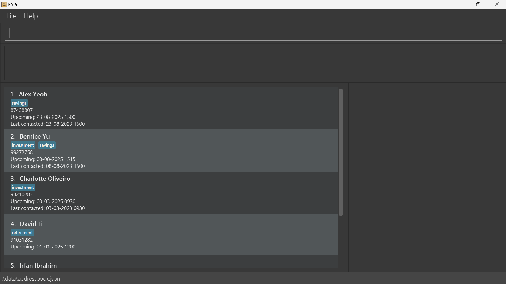
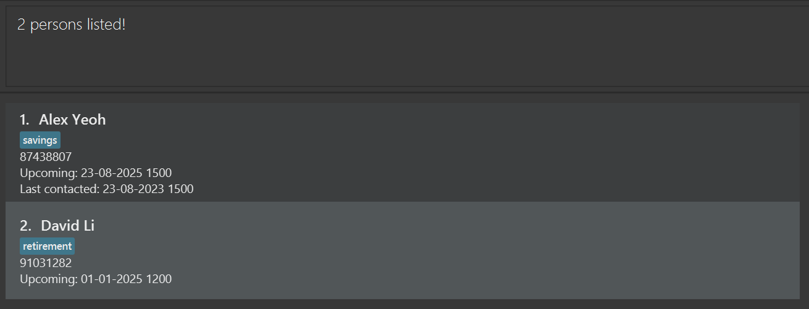
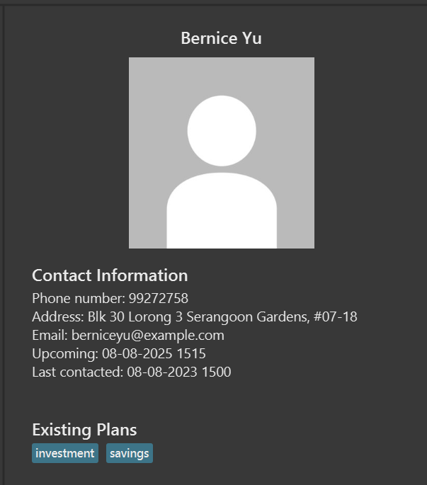

# FApro User Guide

<!-- * Table of Contents -->
<page-nav-print />

## Welcome Note

Greetings financial advisors, hope you are doing well! We would like to thank you for your services all these years. Your hard work has not gone unnoticed! Particularly, we have observed that you may be be facing issues in the following aspects:
* **Client Engagement Tracking**: Difficulty in monitoring the service history of a large, diverse client base to ensure satisfaction.
* **Appointment Management**: Significant time and effort spent on scheduling and remembering appointments.
* **Document Accessibility**: Challenges in promptly recalling or locating specific customer portfolio documents.

Thus, we have specially developed _FApro_ to aid you in your everyday tasks so that you are able to spend more time fostering **meaningful relationships** and providing **personalized service**.

You may refer to the [Product Information](#product-information) section to find out more about _FApro_. If you are keen to use our product, we have a [Quick Start](#quick-start) dedicated to help you get started with ease. We hope you enjoy using _FApro_!

--------------------------------------------------------------------------------------------------------------------

## Purpose of this User Guide

Dear financial advisors, this User Guide will aid you in your journey when navigating _FApro_. We have included beginner-friendly instructions to help you get started, familiarise yourself with our various features. Additionally, we also have some examples to let you test out the product and tips to help you fully utilize our product. We hope you have an amazing time using our product!

--------------------------------------------------------------------------------------------------------------------

## Product Information
_FApro_ is a **desktop app for managing clients' contacts, optimized for use via a Command Line Interface** (CLI) which allows you to type commands while still having the benefits of a Graphical User Interface (GUI) which allows you to use your mouse to execute commands.

Thus if you
* are a financial advisor,
* can type fast,
* have more than 50 clients,
* wants to save time,

then, this is the app for you!

_FApro_ can get your client management tasks done faster than traditional GUI apps enabling you to **maximize personal touch**, **maximize productivity**, and **maximize workflow efficiency** :arrow_up: 

We are able to achieve this by:
* helping you to manage upcoming meetings
* helping you to identify clients to contact
* helping you to retrieve vital information

with **ease** and with **just our application**, nothing more.

--------------------------------------------------------------------------------------------------------------------

## Quick Start

1. Ensure you have Java `11` or above installed in your Computer.

2. Download the latest `fapro.jar` from [here](https://github.com/AY2324S2-CS2103T-F13-2/tp/releases).

3. Copy the file to the folder you want to use as the _home folder_ for your FApro.

4. Open a command terminal, type in `cd` followed by the folder you put the jar file in. 

<box type="info" seamless>

**Info:** `cd` stands for _current directory_.
This step is akin to clicking into folder, but instead we do it through the terminal by only typing.

Example: `cd Documents\fapro`

This is equivalent to (1) 'clicking' into the _Documents_ folder (2) then click into the _fapro_ folder inside the _Documents_ folder.
</box>

5. Type in the `java -jar fapro.jar` command to run the application. 

   A GUI similar to the below should appear in a few seconds. Note how the app contains some sample data. 
   

6. Type the command in the command box and press Enter to execute it. e.g. typing **`help`** and pressing Enter will open the help window. 
   Some example commands you can try:

   * `list` : Lists all clients' contacts.

   * `add n/John Doe p/98765432 e/johnd@example.com a/John street, block 123, #01-01 u/16-03-2025 0800 lc/16-03-2023 0800` : Adds a client named `John Doe` to FApro.

   * `delete 3` : Deletes the 3rd client's contact shown in the current list.

   * `clear` : Deletes all clients' contacts.

   * `exit` : Exits the app.

7. Refer to the [Features](#features) below for details of each command.

--------------------------------------------------------------------------------------------------------------------

## How to use the User Guide

<box type="info" seamless>

**Notes about the command format:** 

* Words in `UPPER_CASE` are the parameters to be supplied by the user. 
  e.g. in `add n/NAME`, `NAME` is a parameter which can be used as `add n/John Doe`.

* Items in square brackets are optional. 
  e.g `n/NAME [t/TAG]` can be used as `n/John Doe t/friend` or as `n/John Doe`.

* Items with `…`​ after them can be used multiple times including zero times. 
  e.g. `[t/TAG]…​` can be used as ` ` (i.e. 0 times), `t/friend`, `t/friend t/family` etc.

* Parameters can be in any order. 
  e.g. if the command specifies `n/NAME p/PHONE_NUMBER`, `p/PHONE_NUMBER n/NAME` is also acceptable.

* Extraneous parameters for commands that do not take in parameters (such as `help`, `list`, `exit` and `clear`) will be ignored. 
  e.g. if the command specifies `help 123`, it will be interpreted as `help`.

* If you are using a PDF version of this document, be careful when copying and pasting commands that span multiple lines as space characters surrounding line-breaks may be omitted when copied over to the application.

* `DATETIME` format must be in `DD-MM-YYYY HHmm` format.
</box>

If this is your **first time** using _FApro_ and wants to gain a better understanding of the product, you may
1. Set up _FApro_ using the instructions given in the [Quick Start](#quick-start) section.
2. Take a look at the [Command Summary](#command-summary) to see the list of commands _FApro_ has.
3. Look through all the commands and try them out using the format and examples given (if any). Some simple commands do not have examples.
4. Take note of the limitations of the product by taking a look at the [Known Issues](#known-issues) section.

If this is your **first few time** using _FApro_ and wants to gain a better understanding of a particular command, you may
1. Look for the command in the Table of Contents.
2. Click on the command you are looking for, you will be directed to the command section in the User Guide
2. Take a look at the purpose of this command to understand its capabilities and limitations.
3. Take note of it's command format.
4. Take note of any additional tips or notes.
5. Try out the command on your desktop to familiarise yourself with it.

If this is your **first few time** using _FApro_ and troubleshoot an error for a command, you may
1. Look for the command in the Table of Contents.
2. Click on the command you are looking for, you will be directed to the command section in the User Guide
3. Take note of it's command format. Compare it with the command that you have entered to see if there is any difference.
4. If you are able to spot the difference, proceed to rectify it. Else, you may refer to the [Known Issues](#known-issues) section to see if the error has not currently been resolved.

## Features

### Viewing help : `help`

Shows a message explaning how to access the help page.

Format: `help`

### Adding a client : `add`

Adds a client to FApro.

Format: `add n/NAME p/PHONE_NUMBER e/EMAIL a/ADDRESS [t/TAG]…​ [lc/DATETIME] [u/DATETIME]`

* Last contacted `lc/` should not have a future `DATETIME` and must be valid.
* Upcoming  `u/` should not have a past `DATETIME` and must be valid

<box type="tip" seamless>

**Tip:** A client can have any number of tags (including 0)
</box>

**Note:** t/ , lc/ and u/ : tag, last contacted and upcoming fields are optional.

Examples:
* `add n/John Doe p/98765432 e/johnd@example.com a/John street, block 123, #01-01 lc/16-03-2024 0800`
* `add n/Betsy Crowe e/betsycrowe@example.com a/Newgate Prison p/1234567 t/health`
* `add n/Bobby Tan t/investment e/amk@gmail.com a/ang mo kio ave 3 u/01-01-2025 1300 p/88392302`

### Listing all clients : `list`

Shows a list of all clients in FApro.

Format: `list`

### Editing a client : `edit`

Edits an existing client in FApro.

Format: `edit INDEX [n/NAME] [p/PHONE] [e/EMAIL] [a/ADDRESS] [t/TAG]... [lc/DATETIME] [u/DATETIME]`

* Edits the client at the specified `INDEX`. The index refers to the index number shown in the displayed client list. The index **must be a positive integer** 1, 2, 3, …​
* At least one of the optional fields must be provided.
* Existing values will be updated to the input values.
* When editing tags, the existing tags of the client will be removed i.e. adding of tags is not cumulative.
* You can remove all the client’s tags by typing `t/` without
    specifying any tags after it.
* Last contacted `lc/` should not have a future `DATETIME` and must be valid. 
* Upcoming `u/` should not have a past `DATETIME` and must be valid. 

Examples:
*  `edit 1 p/91234567 e/johndoe@example.com` Edits the phone number and email address of the 1st client to be `91234567` and `johndoe@example.com` respectively.
*  `edit 2 n/Betsy Crower t/` Edits the name of the 2nd client to be `Betsy Crower` and clears all existing tags.

### Locating clients by name : `find`

Finds clients whose names contain any of the given keywords.

Format: `find KEYWORD [MORE_KEYWORDS]`

* The search is case-insensitive. e.g `hans` will match `Hans`
* The order of the keywords does not matter. e.g. `Hans Bo` will match `Bo Hans`
* Only the name is searched.
* Only full words will be matched e.g. `Han` will not match `Hans`
* Clients matching at least one keyword will be returned (i.e. `OR` search).
  e.g. `Hans Bo` will return `Hans Gruber`, `Bo Yang`

Examples:
* `find John` returns `john` and `John Doe`
* `find alex david` returns `Alex Yeoh`, `David Li` 

### Locating clients by tag : `findtagsor`

Finds clients who contain one of the specified tags.

Format: `findtagsor TAG [MORE_TAGS]`

* The search is case-insensitive. e.g. `CaR` will match `car`.
* As long as the client has 1 tag that matches, the client will be listed.
* Only full words will be matched e.g. `cars` will not match `car`.

Examples:
* `findtagsor car` returns all clients with a `car` tag.
* `findtagsor HOUSING` returns all clients with a `housing` tag.

### Locating clients by tag : `findtagsand`

Finds clients who contain all the specified tags.

Format: `findtagsand TAG [MORE_TAGS]`

* The search is case-insensitive. e.g. `CaR` will match `car`.
* Client must contain all tags to be listed.
* Only full words will be matched e.g. `cars` will not match `car`.

Examples:
* `findtagsand car covid` returns all clients with `car` and `covid` tags.
* `findtagsand HOUSING` returns all clients with a `housing` tag.

### Adding tags to a client : `addtags`

Add tags to specified client.

Format: `addtags INDEX t/TAG [t/MORE_TAGS]`

* Add tags to the client at the specified `INDEX`. The index refers to the index number shown in the displayed client list. The index **must be a positive integer** 1, 2, 3, …​
* At least one tag must be provided.
* Duplicate tags will be ignored.
* Tags are case-insensitive. e.g. `cAr` and `car` are the same tags.

Examples:
* `addtags 1 t/car t/covid` adds `car` and `covid` tags to the 1st client. 
* `addtags 2 t/HOUSING` adds `housing` tag to the 2nd client.

### Deleting a client : `delete`

Deletes the specified client from FApro.

Format: `delete INDEX`

* Deletes the client at the specified `INDEX`.
* The index refers to the index number shown in the displayed client list.
* The index **must be a positive integer** 1, 2, 3, …​

Examples:
* `list` followed by `delete 2` deletes the 2nd client in FApro.
* `find Betsy` followed by `delete 1` deletes the 1st client in the results of the `find` command.

### Viewing the detailed profile a client : `select`

View a more detailed profile of the specified client from FApro. The detailed profile currently includes the **contact information** and **existing plans**. In addition, we are also planning to include the following:
* Profile image of the client: [Uploading a profile photo for a client](#coming-soon-uploading-photo-for-a-client--image)
* Notes regarding the client: [Adding notes for a client](#coming-soon-adding-notes-for-a-client--addnote)

This profile aims to aid financial advisors in the following ways:
* retrieve vital information (existing financial plans, current financial status) during the preparation for an appointment
* act as a reference notes during the appointment itself
* take down important notes after the appointments (follow-up tasks)

Format: `select INDEX`

* Displays the profile of the client at the specified `INDEX`.
* The index refers to the index number shown in the displayed client list.
* The index **must be a positive integer** 1, 2, 3, …​

Examples:
* `list` followed by `select 2` shows the detailed profile of the 2nd client in FApro.
* `find bernice` followed by `select 1` shows the detailed profile of the 1st client in the results of the `find` command.

### Viewing contacts of all upcoming appointments : `upcoming`

View all the contacts of all upcoming appointments ordered by date (earliest to latest).

Format: `upcoming`

* `upcoming` displays all upcoming appointments.

Examples:
* `upcoming` would show the 3 contacts if there are 3 contacts with upcoming appointments.

### Viewing contacts of all last contacted clients : `lastcontact`

View all the contacts that has last contacted date and time ordered by date (oldest to recent).

Format: `lastcontact`

* Displays all clients with last contacted field and sorted in oldest date first.

Example:
* `lastcontact` would filter the contacts and show all contacts that has last contacted date time.

### Clearing all entries : `clear`

Clears all entries from FApro.

Format: `clear`

### Exiting the program : `exit`

Exits the program.

Format: `exit`

### Saving the data

FApro data are saved in the hard disk automatically after any command that changes the data. There is no need to save manually.

### Editing the data file

FApro data are saved automatically as a JSON file `[JAR file location]/data/addressbook.json`. Advanced users are welcome to update data directly by editing that data file.

<box type="warning" seamless>

**Caution:**
If your changes to the data file makes its format invalid, FApro will discard all data and start with an empty data file at the next run.  Hence, it is recommended to take a backup of the file before editing it. 
Furthermore, certain edits can cause FApro to behave in unexpected ways (e.g., if a value entered is outside the acceptable range). Therefore, edit the data file only if you are confident that you can update it correctly.
</box>

### (_Coming Soon_) Uploading a profile photo for a client : `image`

Adds a profile photo for a specified client in FApro.

Format: `image INDEX i/PATH`

* Adds the profile photo for the client at the specified `INDEX` with the image found at `PATH`.
* The index refers to the index number shown in the displayed client list.
* The index **must be a positive integer** 1, 2, 3, …​
* The path refers to the relative path of the image to the main repository.
* If there is no photo uploaded, the profile photo section will display a placeholder profile photo.

Examples:
* `list` followed by `image 3 i/profiles/charlotte.png` adds a profile photo found at `profiles/charlotte.png` to the 3rd client in FApro.
* `find david` followed by `image 1 i/profiles/david.png` adds a profile photo found at `profiles/david.png` to the 1st client in the results of the `find` command.

### (_Coming Soon_) Adding notes for a client : `addnote`

Adds note for a specified client in FApro. This feature can be used
* during preparation for appointment: to take note of what to say during it
* during the appointmeent: to take note of what the client is saying
* after the appointment: to take not of the follow-up actions

Format: `addnotes INDEX note/NOTE [note/NOTE]`

* Adds `NOTE` for the client at the specified `INDEX`.
* The index refers to the index number shown in the displayed client list.
* The index **must be a positive integer** 1, 2, 3, …​
* At least one `NOTE` must be provided.
* There is no restriction to the length and format of the `NOTE`.
* The `NOTE` can only be viewed in the [detailed profile](#viewing-the-detailed-profile-a-client--select).

Examples:
* `list` followed by `addnote 3 note/remind her to check her yearly coupon note/wants to retrieve her money from her savings plan` adds a note to the 3rd client in FApro.
* `find david` followed by `addnote 1 note/looking for insurance plans` adds a note to the 1st client in the results of the `find` command.

--------------------------------------------------------------------------------------------------------------------

## FAQ

**Q**: How do I transfer my data to another Computer? 
**A**: Install the app in the other computer and overwrite the empty data file it creates with the file that contains the data of your previous FApro home folder.

--------------------------------------------------------------------------------------------------------------------

## Known Issues

1. **When using multiple screens**, if you move the application to a secondary screen, and later switch to using only the primary screen, the GUI will open off-screen. The remedy is to delete the `preferences.json` file created by the application before running the application again.
2. **When the tags are too long**, there is no length restriction on the tags. However, when you add a tag that is too long, the last few characters will be cut off and will not be able to be seen in any window size. The remedy is to shorten the tag's name. We understand that this is not optimal, and we are currently looking at ways to accommodate tags with very long names.

--------------------------------------------------------------------------------------------------------------------

## Command Summary

Action     | Format, Examples
-----------|------------------------------------------------------------------------------------------------------------------------------------------------------------
**Add**    | `add n/NAME p/PHONE_NUMBER e/EMAIL a/ADDRESS [t/TAG]… [lc/DATETIME] [u/DATETIME]`   e.g. `add n/James Ho p/22224444 e/jamesho@example.com a/123, Clementi Rd, 1234665 t/friend t/colleague`
**Clear**  | `clear`
**Delete** | `delete INDEX`  e.g. `delete 3`
**Edit**   | `edit INDEX [n/NAME] [p/PHONE_NUMBER] [e/EMAIL] [a/ADDRESS] [t/TAG]… [lc/DATETIME] [u/DATETIME]`  e.g.`edit 2 n/James Lee e/jameslee@example.com`
**Find**   | `find KEYWORD [MORE_KEYWORDS]`  e.g. `find James Jake`
**FindTagsOr**| `findtagsor TAG [MORE_TAGS]…​`   e.g. `findtagsor car health`
**FindTagsAnd**| `findtagsand TAG [MORE_TAGS]…​`   e.g. `findtagsand car housing`
**AddTags**| `addtags INDEX t/TAG [t/MORE_TAGS]…​`   e.g. `addtags 1 car housing`
**Lastcontact**| `lastcontact`
**Upcoming**| `upcoming`
**List**   | `list`
**Select** | `select INDEX`  e.g. `select 1`
**Help**   | `help`
**Exit**   | `exit`
**_(Coming soon)_ image**   | `image INDEX i/PATH`  e.g. `image 1 i/profiles/david.png`
**_(Coming soon)_ addnote**   | `addnote INDEX note/NOTE [note/NOTE]`  e.g. `addnote 3 note/remind her to check her yearly coupon note/wants to retrieve her money from her savings plan`