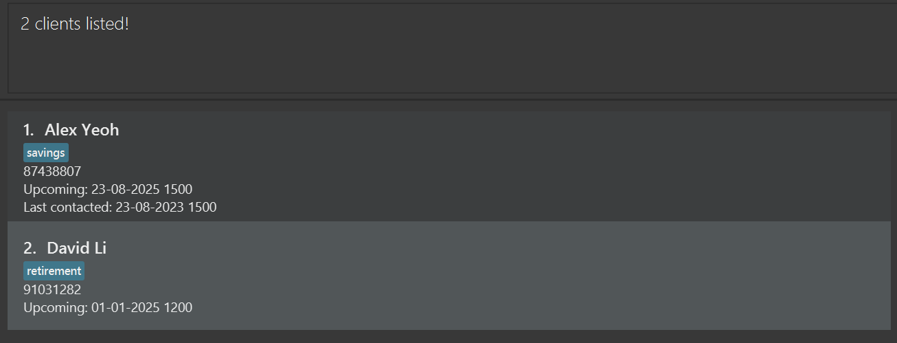

# FApro User Guide

<!-- * Table of Contents -->
<page-nav-print />

## Welcome Note

Greetings financial advisors, hope you are doing well! We would like to thank you for your services all these years. Your hard work has not gone unnoticed! Particularly, we have observed that you may be facing issues in the following aspects:
* **Client Engagement Tracking**: Difficulty in monitoring the service history of a large, diverse client base to ensure satisfaction.
* **Appointment Management**: Significant time and effort spent on scheduling and remembering appointments.
* **Document Accessibility**: Challenges in promptly recalling or locating specific customer portfolio documents.

Thus, we have specially developed _FApro_ to aid you in your everyday tasks so that you are able to spend more time fostering **meaningful relationships** and providing **personalized service**.

You may refer to the [Product Information](#product-information) section to find out more about _FApro_. If you are keen to use our product, we have a [Quick Start](#quick-start) dedicated to help you get started with ease. We hope you enjoy using _FApro_!

--------------------------------------------------------------------------------------------------------------------

## Purpose of this User Guide

This User Guide will aid you in your journey when navigating _FApro_. We have included beginner-friendly instructions to help you get started, familiarise yourself with our various features. Additionally, we've included examples and tips to enhance your experience with our product. We hope you enjoy using it to its fullest potential!

--------------------------------------------------------------------------------------------------------------------

## Product Information
_FApro_ is a **desktop app for managing clients' contacts, optimized for use via a Command Line Interface** (CLI) which allows you to type commands while still having the benefits of a Graphical User Interface (GUI) which allows you to use your mouse to execute commands.

Thus, if you
* are a financial advisor,
* can type fast,
* have more than 50 clients,
* wants to save time,

then, this is the ultimate all-in-one app for you!

_FApro_ can get your client management tasks done faster than traditional GUI apps enabling you to **maximize personal touch**, **maximize productivity**, and **maximize workflow efficiency**.

We are able to achieve this by helping you to
* manage upcoming meetings
* identify clients to contact
* to retrieve vital information

with **ease** and with **just our application**, nothing more.

--------------------------------------------------------------------------------------------------------------------

## Quick Start

1. Ensure you have Java `11` or above installed in your Computer.

2. Download the latest `fapro.jar` from [here](https://github.com/AY2324S2-CS2103T-F13-2/tp/releases).

3. Copy the file to the folder you want to use as the _home folder_ for your FApro.

4. Open a command terminal, type in `cd` followed by the folder you put the jar file in. 

<box type="info" seamless>

**Info:** `cd` stands for _current directory_.
This step is akin to clicking into folder, but instead we do it through the terminal by typing.

Example: `cd Documents\fapro`

This is equivalent to 
1. 'clicking' into the _Documents_ folder
2. 'clicking' into the _fapro_ folder inside the _Documents_ folder.
</box>

5. Type in the `java -jar fapro.jar` command to run the application. 

   A GUI similar to the below should appear in a few seconds. Note how the app contains some sample data. 
   

6. Type the command in the command box and press _Enter_ on your keyboard to execute it. e.g. typing **`help`** and pressing Enter will open the help window. 
   Some example commands you can try:

   * `list` : Lists all clients' contacts.

   * `add n/John Doe p/98765432 e/johnd@example.com a/John street, block 123, #01-01 u/16-03-2025 0800 lc/16-03-2023 0800` : Adds a client named `John Doe` to FApro.

   * `delete 3` : Deletes the 3rd client's contact shown in the current list.

   * `clear` : Deletes all clients' contacts.

   * `exit` : Exits the app.

7. Refer to the [Features](#features) below for details of each command.

--------------------------------------------------------------------------------------------------------------------

## How to use the User Guide

If this is your **first time** using _FApro_ and wants to gain a better understanding of the product, you may
1. Set up _FApro_ using the instructions given in the [Quick Start](#quick-start) section.
2. Take a look at the [Command Summary](#command-summary) to see the list of commands _FApro_ has.
3. Look through all the commands and try them out using the format and examples given (if any). Some simple commands do not have examples.
4. Take note of the limitations of the product by taking a look at the [Known Issues](#known-issues) section.

If this is your **first few time** using _FApro_ and wants to gain a better understanding of a particular command, you may
1. Look for the command in the Table of Contents.
2. Click on the command you are looking for, you will be directed to the command's section in the User Guide
2. Take a look at the purpose of this command to understand its capabilities and limitations.
3. Take note of it's command format.
4. Take note of any additional tips or notes.
5. Try out the command on your desktop to familiarise yourself with it.

If this is your **first few time** using _FApro_ and troubleshoot an error for a command, you may
1. Look for the command in the Table of Contents.
2. Click on the command you are looking for, you will be directed to the command's section in the User Guide
3. Take note of it's command format. Compare it with the command that you have entered to see if there is any difference.
4. If you are able to spot the difference, proceed to rectify it. 
5. Else, you may refer to the [Known Issues](#known-issues) section to check if the error is a known issue that is currently being fixed.

## Features

<box type="info" seamless>

**Notes about the command format:** 

* Words in `UPPER_CASE` are the parameters to be supplied by the user. 
  e.g. in `add n/NAME`, `NAME` is a parameter which can be used as `add n/John Doe`.

* Items in square brackets are optional. 
  e.g `n/NAME [t/PLAN]` can be used as `n/John Doe t/friend` or as `n/John Doe`.

* Items with `…`​ after them can be used multiple times including zero times. 
  e.g. `[t/PLAN]…​` can be used as ` ` (i.e. 0 times), `t/friend`, `t/friend t/family` etc.

* Parameters can be in any order. 
  e.g. if the command specifies `n/NAME p/PHONE_NUMBER`, `p/PHONE_NUMBER n/NAME` is also acceptable.

* Extraneous parameters for commands that do not take in parameters (such as `help`, `list`, `exit` and `clear`) will be ignored. 
  e.g. if the command specifies `help 123`, it will be interpreted as `help`.

* If you are using a PDF version of this document, be careful when copying and pasting commands that span multiple lines as space characters surrounding line-breaks may be omitted when copied over to the application.

* `DATETIME` format must be in `DD-MM-YYYY HHmm` format.

</box>

### Viewing help : `help`

Shows a message explaning how to access the help page.

Format: `help`

### Adding a client : `add`

Adds a client to FApro.

Format: `add n/NAME p/PHONE_NUMBER e/EMAIL a/ADDRESS [t/PLAN]…​ [lc/DATETIME] [u/DATETIME]`

* Phone number should contain only numbers and be at least 3 digits long.
* Email should have a format of username@domain.
* Username should only contain alphanumeric characters and the characters (+\_.-) excluding the parenthesis
and should not start with the above-mentioned characters.
* Domain must be at least 2 characters long and can only contain alphanumeric characters and hyphens.
* Plans should only contain alphanumeric characters with no whitespaces.
* Last contacted `lc/` should not have a future `DATETIME` and must be valid.
* Upcoming  `u/` should not have a past `DATETIME` and must be valid.

<box type="tip" seamless>

**Tip:** A client can have any number of plans (including 0)

</box>
<box type="warning" seamless>

**Caution:** Though there is no length restriction in terms of number of characters for each plan. Plans that are too long may have the last few characters cut off by the UI. We are currently fixing this issue and updates will be coming in the next iteration.

</box>

**Note:** t/ , lc/ and u/ : plan, last contacted and upcoming fields are optional.

Examples:
* `add n/John Doe p/98765432 e/johnd@example.com a/John street, block 123, #01-01 lc/16-03-2024 0800`
* `add n/Betsy Crowe e/betsycrowe@example.com a/Newgate Prison p/1234567 t/health`
* `add n/Bobby Tan t/investment e/amk@gmail.com a/ang mo kio ave 3 u/01-01-2025 1300 p/88392302 lc/16-03-2024 0800`

Once added, a client card consisting of the **name, existing plans, upcoming meeting date and last-contacted date** will be shown in the client list. The rest of the information will only be shown when the client is [selected](#viewing-the-detailed-profile-a-client--select). This is to prevent the main list from being too cluttered. 

### Listing all clients : `list`

Shows a list of all clients in FApro.

Format: `list`

### Editing a client : `edit`

Edits an existing client in FApro.

Format: `edit INDEX [n/NAME] [p/PHONE] [e/EMAIL] [a/ADDRESS] [t/PLAN]... [lc/DATETIME] [u/DATETIME]`

* Edits the client at the specified `INDEX`. The index refers to the index number shown in the displayed client list. The index **must be a positive integer** 1, 2, 3, …​
* At least one of the optional fields must be provided.
* Existing values will be updated to the input values.
* When editing plans, the existing plans of the client will be removed i.e. adding of plans is not cumulative.
* You can remove all the client’s plans by typing `t/` without
    specifying any plans after it.
* Phone number should contain only numbers and be at least 3 digits long.
* Email should have a format of username@domain.
* Username should only contain alphanumeric characters and the characters (+\_.-) excluding the parenthesis
  and should not start with the above-mentioned characters.
* Domain must be at least 2 characters long and can only contain alphanumeric characters and hyphens.
* Plans should only contain alphanumeric characters with no whitespaces.
* Last contacted `lc/` should not have a future `DATETIME` and must be valid.
* Upcoming `u/` should not have a past `DATETIME` and must be valid.

Examples:
*  `edit 1 p/91234567 e/johndoe@example.com` Edits the phone number and email address of the 1st client to be `91234567` and `johndoe@example.com` respectively.
*  `edit 2 n/Betsy Crower t/` Edits the name of the 2nd client to be `Betsy Crower` and clears all existing plans.

### Locating clients by name : `find`

Finds clients whose names contain any of the given keywords.

Format: `find KEYWORD [MORE_KEYWORDS]`

* The search is case-insensitive. e.g `hans` will match `Hans`
* The order of the keywords does not matter. e.g. `Hans Bo` will match `Bo Hans`
* Only the name is searched.
* Only full words will be matched e.g. `Han` will not match `Hans`
* Clients matching at least one keyword will be returned (i.e. `OR` search).
  e.g. `Hans Bo` will return `Hans Gruber`, `Bo Yang`

Examples:
* `find John` returns `john` and `John Doe`
* `find alex david` returns `Alex Yeoh`, `David Li` 

### Locating clients by plan : `findtagsor`

Finds clients who contain one of the specified plans.

Format: `findtagsor PLAN [MORE_PLANS]`

* The search is case-insensitive. e.g. `CaR` will match `car`.
* As long as the client has 1 plan that matches, the client will be listed.
* Only full words will be matched e.g. `cars` will not match `car`.
* At least one plan must be provided for the search to work. Not including a plan will result in an error.
* Plans should only contain alphanumeric characters with no whitespaces.

Examples:
* `findtagsor car` returns all clients with a `car` plan.
* `findtagsor HOUSING` returns all clients with a `housing` plan.

### Locating clients by plan : `findtagsand`

Finds clients who contain all the specified plans.

Format: `findtagsand PLAN [MORE_PLANS]`

* The search is case-insensitive. e.g. `CaR` will match `car`.
* Client must contain all plans to be listed.
* Only full words will be matched e.g. `cars` will not match `car`.
* At least one plan must be provided for the search to work. Not including a plan will result in an error.
* Plans should only contain alphanumeric characters with no whitespaces.

Examples:
* `findtagsand car covid` returns all clients with `car` and `covid` plans.
* `findtagsand HOUSING` returns all clients with a `housing` plan.

### Adding plans to a client : `addtags`

Add plans to specified client.

Format: `addtags INDEX t/PLAN [t/MORE_PLANS]...`

* Add plans to the client at the specified `INDEX`. The index refers to the index number shown in the displayed client list. The index **must be a positive integer** 1, 2, 3, …​
* At least one plan must be provided.
* Duplicate plans will be ignored.
* Plans are case-insensitive. e.g. `cAr` and `car` are the same plans.
* Plans should only contain alphanumeric characters with no whitespaces.

Examples:
* `addtags 1 t/car t/covid` adds `car` and `covid` plans to the 1st client.
* `addtags 2 t/HOUSING` adds `housing` plan to the 2nd client.

### Deleting a client : `delete`

Deletes the specified client from FApro.

Format: `delete INDEX`

* Deletes the client at the specified `INDEX`.
* The index refers to the index number shown in the displayed client list.
* The index **must be a positive integer** 1, 2, 3, …​

Examples:
* `list` followed by `delete 2` deletes the 2nd client in FApro.
* `find Betsy` followed by `delete 1` deletes the 1st client in the results of the `find` command.

### Viewing the detailed profile a client : `select`

View a more detailed profile of the specified client from FApro. The detailed profile currently includes the **contact information** and **existing plans**. In addition, we are also planning to include the following:
* Profile image of the client: [Uploading a profile photo for a client](#coming-soon-uploading-photo-for-a-client--image)
* Notes regarding the client: [Adding notes for a client](#coming-soon-adding-notes-for-a-client--addnote)

This profile aims to aid financial advisors in the following ways:
* retrieve vital information (existing financial plans, current financial status) during the preparation for an appointment
* act as a reference notes during the appointment itself
* take down important notes after the appointments (follow-up tasks)

Format: `select INDEX`

* Displays the profile of the client at the specified `INDEX`.
* The index refers to the index number shown in the displayed client list.
* The index **must be a positive integer** 1, 2, 3, …​

<box type="info" seamless>

**Info:** The profile panel will auto-update when changes are made to a client using the [edit command](#editing-a-client--edit) and the [addtags command](#adding-tags-to-a-client--addtags). However, there is currently no way to 'unselect' a client, clear the profile panel. Even when the client is deleted using the [delete command](#deleting-a-client--delete) or all the clients are cleared using the [clear command](#clearing-all-entries--clear), the selected client's profile will still be displayed on the profile panel. We are currently fixing this issue and updates will be coming in the next iteration.

</box>

Examples:
* `list` followed by `select 2` shows the detailed profile of the 2nd client in FApro.
* `find bernice` followed by `select 1` shows the detailed profile of the 1st client in the results of the `find` command.

Once selected, a client profile consisting of the **all the details** will be shown in the profile panel.

### Viewing contacts of all upcoming appointments : `upcoming`

View all the contacts of all upcoming appointments ordered by date (earliest to latest).

Format: `upcoming`

* `upcoming` displays all upcoming appointments.

Examples:
* `upcoming` would show the 3 contacts if there are 3 contacts with upcoming appointments.

### Viewing contacts of all last contacted clients : `lastcontact`

View all the contacts that has last contacted date and time ordered by date (oldest to recent).

Format: `lastcontact`

* Displays all clients with last contacted field and sorted in oldest date first.
* Clients are arranged by the oldest contact date to help users systematically prioritize outreach, maintaining relationships effectively.

Example:
* `lastcontact` would filter the contacts and show all contacts that has last contacted date time.

### Clearing all entries : `clear`

Clears all entries from FApro.

Format: `clear`

### Exiting the program : `exit`

Exits the program.

Format: `exit`

### Saving the data

FApro data are saved in the hard disk automatically after any command that changes the data. There is no need to save manually.

### Editing the data file

FApro data are saved automatically as a JSON file `[JAR file location]/data/addressbook.json`. Advanced users are welcome to update data directly by editing that data file.

<box type="warning" seamless>

**Caution:**
If your changes to the data file makes its format invalid, FApro will discard all data and start with an empty data file at the next run.  Hence, it is recommended to take a backup of the file before editing it. 
Furthermore, certain edits can cause FApro to behave in unexpected ways (e.g., if a value entered is outside the acceptable range). Therefore, edit the data file only if you are confident that you can update it correctly.
</box>

### (_Coming Soon_) Uploading a profile photo for a client : `image`

Adds a profile photo for a specified client in FApro.

Format: `image INDEX i/PATH`

* Adds the profile photo for the client at the specified `INDEX` with the image found at `PATH`.
* The index refers to the index number shown in the displayed client list.
* The index **must be a positive integer** 1, 2, 3, …​
* The path refers to the relative path of the image to the main repository.
* If there is no photo uploaded, the profile photo section will display a placeholder profile photo.

Examples:
* `list` followed by `image 3 i/profiles/charlotte.png` adds a profile photo found at `profiles/charlotte.png` to the 3rd client in FApro.
* `find david` followed by `image 1 i/profiles/david.png` adds a profile photo found at `profiles/david.png` to the 1st client in the results of the `find` command.

### (_Coming Soon_) Adding notes for a client : `addnote`

Adds note for a specified client in FApro. This feature can be used
* during preparation for appointment: to take note of what to say during it
* during the appointmeent: to take note of what the client is saying
* after the appointment: to take note of the follow-up actions

Format: `addnote INDEX note/NOTE [note/MORE_NOTES]...`

* Adds `NOTE` for the client at the specified `INDEX`.
* The index refers to the index number shown in the displayed client list.
* The index **must be a positive integer** 1, 2, 3, …​
* At least one `NOTE` must be provided.
* There is no restriction to the length and format of the `NOTE`.
* The `NOTE` can only be viewed in the [detailed profile](#viewing-the-detailed-profile-a-client--select).

Examples:
* `list` followed by `addnote 3 note/remind her to check her yearly coupon note/wants to retrieve her money from her savings plan` adds 2 notes to the 3rd client in FApro.
* `find david` followed by `addnote 1 note/looking for insurance plans` adds a note to the 1st client in the results of the `find` command.

### (_Coming Soon_) Deleting plans of a client : `deletetags`

Deletes plans of a specified client.

Format: `deletetags INDEX t/PLAN [t/MORE_PLANS]...`

* Delete plans of the client at the specified `INDEX`. The index refers to the index number shown in the displayed client list. The index **must be a positive integer** 1, 2, 3, …​
* At least one tag must be provided.
* Duplicate plans will be ignored.
* Plans are case-insensitive. e.g. `cAr` and `car` are the same plans.

Examples:
* `deletetags 1 t/car t/covid` deletes `car` and `covid` plans of the 1st client.
* `deletetags 2 t/HOUSING` deletes `housing` plan of the 2nd client.
--------------------------------------------------------------------------------------------------------------------

## FAQ

**Q**: How do I transfer my data to another Computer? 
**A**: Install the app in the other computer and overwrite the empty data file it creates with the file that contains the data of your previous FApro home folder.

--------------------------------------------------------------------------------------------------------------------

## Known Issues

1. **When using multiple screens**, if you move the application to a secondary screen, and later switch to using only the primary screen, the GUI will open off-screen. The remedy is to delete the `preferences.json` file created by the application before running the application again.
2. **When the plans are too long**, the last few characters will be cut off and will not be able to be seen in any window size. The remedy is to shorten the plan's name. We understand that this is not optimal, and we are currently looking at ways to accommodate plans with very long names.
3. **When the client is deleted or all the clients are cleared from FApro**, the selected client's profile will still be displayed on the profile panel. We currently have no remedy for this but are currently fixing this issue.

--------------------------------------------------------------------------------------------------------------------

## Command Summary

Action     | Format, Examples
-----------|------------------------------------------------------------------------------------------------------------------------------------------------------------
**Add**    | `add n/NAME p/PHONE_NUMBER e/EMAIL a/ADDRESS [t/PLAN]… [lc/DATETIME] [u/DATETIME]`   e.g. `add n/James Ho p/22224444 e/jamesho@example.com a/123, Clementi Rd, 1234665 t/friend t/colleague`
**Clear**  | `clear`
**Delete** | `delete INDEX`  e.g. `delete 3`
**Edit**   | `edit INDEX [n/NAME] [p/PHONE_NUMBER] [e/EMAIL] [a/ADDRESS] [t/PLAN]… [lc/DATETIME] [u/DATETIME]`  e.g.`edit 2 n/James Lee e/jameslee@example.com`
**Find**   | `find KEYWORD [MORE_KEYWORDS]`  e.g. `find James Jake`
**FindTagsOr**| `findtagsor PLAN [MORE_PLANS]…​`   e.g. `findtagsor car health`
**FindTagsAnd**| `findtagsand PLAN [MORE_PLANS]…​`   e.g. `findtagsand car housing`
**AddTags**| `addtags INDEX t/PLAN [t/MORE_PLANS]…​`   e.g. `addtags 1 t/car t/covid`
**Lastcontact**| `lastcontact`
**Upcoming**| `upcoming`
**List**   | `list`
**Select** | `select INDEX`  e.g. `select 1`
**Help**   | `help`
**Exit**   | `exit`
**_(Coming soon)_ image**   | `image INDEX i/PATH`  e.g. `image 1 i/profiles/david.png`
**_(Coming soon)_ addnote**   | `addnote INDEX note/NOTE [note/MORE_NOTES]...`  e.g. `addnote 3 note/remind her to check her yearly coupon note/wants to retrieve her money from her savings plan`
**_(Coming soon)_ DeleteTags**   | `deletetags INDEX t/PLAN [t/MORE_PLANS]…​`   e.g. `deletetags 1 t/car t/covid`
