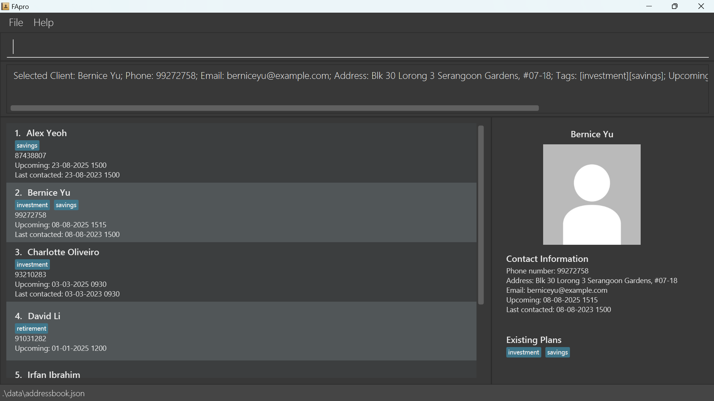

# FAPro

_FApro_ is a **desktop app for managing clients' contacts, optimized for use via a Command Line Interface** (CLI) which allows you to type commands while still having the benefits of a Graphical User Interface (GUI) which allows you to use your mouse to execute commands.

* If you are interested in using FApro, head over to the [_Quick Start_ section of the **User Guide**](UserGuide.html#quick-start).
* If you are interested about developing FApro, the [**Developer Guide**](DeveloperGuide.html) is a good place to start.

**Acknowledgements**

* Libraries used: [JavaFX](https://openjfx.io/), [Jackson](https://github.com/FasterXML/jackson), [JUnit5](https://github.com/junit-team/junit5)
